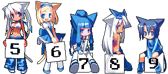
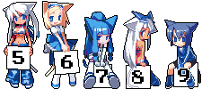
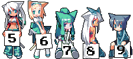

# Kauntah

English | [日本語](./README.ja.md)

A TypeScript-based hit counter running on Cloudflare Workers, inspired by [shimobayashi/kauntah](https://github.com/shimobayashi/kauntah).

> [!TIP]
> Use the [Kauntah Generator](https://kauntah-generate.fjtd.moe/) to preview themes and generate HTML or Markdown embed code.

## Preview

| asset                  | version  | preview                                                |
| ---------------------- | -------- | ------------------------------------------------------ |
| `normal-150` (default) | Ver.0.91 |  |
| `blue2-150`            | Ver.0.93 |    |
| `blue2-100`            | Ver.0.93 |    |
| `green-100`            | Ver.0.93 |    |

## Usage

Simply add the following tag to your page:

```html

```

### Parameters

| Parameter | Example             | Description                                                      |
| --------- | ------------------- | ---------------------------------------------------------------- |
| `asset`   | `?asset=normal-150` | `normal-150` (default) / `blue2-150` / `green-100` / `blue2-100` |
| `offset`  | `?offset=1000`      | Initial value added to the count (max: 1,000,000)                |

### Mechanism

- Automatically identifies the owner based on the hostname of the Referer header.
- Creates an independent counter for each host.
- Available for use by anyone with a site that has its own FQDN.

## Tech Stack

| Layer            | Technology                              | Role                                                       |
| ---------------- | --------------------------------------- | ---------------------------------------------------------- |
| Compute          | Cloudflare Workers (Node.js compatible) | Request handling                                           |
| Framework        | Hono                                    | Routing                                                    |
| Counter          | SQLite-backed Durable Objects           | Atomic increment and the sole persistent count store       |
| Image Cache      | Workers KV                              | Generated SVG cache (24-hour TTL)                          |
| Image Processing | Native SVG rendering                    | Combines Base64 PNG digit assets in SVG                    |
| Rate Limiting    | Cloudflare Rate Limiting API            | Prevents count inflation (30 requests / 60 seconds per IP) |

## Notes

- Rate limiting: Up to 30 requests per 60 seconds from the same IP. Returns `429 Too Many Requests` if exceeded.
- Each successful counter request performs one persistent write to its owner's SQLite-backed Durable Object.
- Before deploying, run `npm run check` to type-check the Worker and verify that Wrangler can build its deployment bundle.
- The original asset images are included in the repository for reference, but are not used directly at runtime. They are embedded as Base64-encoded strings in `src/assets/`.

## Credits

- **Illustration**: [Kokage Kusaka (日下こかげ)](https://x.com/K_KOKAGE)
  - Originally distributed on ["KK's WS"](https://web.archive.org/web/20090831104303/http://kokagex.hp.infoseek.co.jp/) (now closed)
  - For more details, search for "Nekomimi Counter" and "Kokage Kusaka"
  - Non-commercial use, modification, and redistribution are permitted by the author
