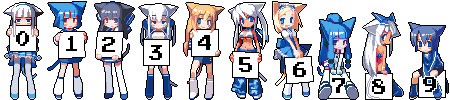
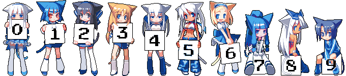
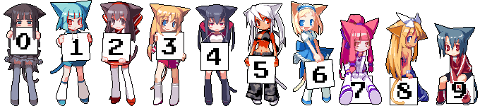

# Kauntah

[日本語](./README.ja.md)

A TypeScript-based hit counter running on Cloudflare Workers, inspired by [shimobayashi/kauntah](https://github.com/shimobayashi/kauntah).

A hit counter running on Cloudflare Workers. Embed it with a single `` tag. Features an atomic counter, image caching, and rate limiting.

## Preview

| asset                | preview                                               |
| -------------------- | ----------------------------------------------------- |
| `nekomimi` (default) |     |
| `blue`               |    |
| `color`              |  |

## Usage

Simply add the following tag to your page:

```html

```

### Parameters

| Parameter | Example           | Description                                       |
| --------- | ----------------- | ------------------------------------------------- |
| `asset`   | `?asset=nekomimi` | `nekomimi` (default) / `blue` / `color`           |
| `offset`  | `?offset=1000`    | Initial value added to the count (max: 1,000,000) |

### Mechanism

- Automatically identifies the owner based on the hostname of the Referer header.
- Creates an independent counter for each host.
- Available for use by anyone with a site that has its own FQDN.

## Tech Stack

| Layer            | Technology                              | Role                                                       |
| ---------------- | --------------------------------------- | ---------------------------------------------------------- |
| Compute          | Cloudflare Workers (Node.js compatible) | Request handling                                           |
| Framework        | Hono                                    | Routing                                                    |
| Counter          | Durable Objects                         | Atomic and strongly consistent increment                   |
| Image Cache      | Workers KV                              | Generated PNG cache (24-hour TTL)                          |
| Image Processing | pngjs                                   | PNG concatenation (no Wasm required)                       |
| Rate Limiting    | Cloudflare Rate Limiting API            | Prevents count inflation (30 requests / 60 seconds per IP) |
| DDoS Protection  | Cloudflare WAF                          | Automatic blocking at the edge                             |

## Deployment

A Cloudflare account with Workers and Durable Objects enabled is required.

1. `npm install`
2. `npx wrangler login`
3. Create a KV namespace and enter the `id` into `wrangler.toml`
4. `npm run deploy`

## Directory Structure

```
kauntah/
├── src/
│   ├── index.ts          # Hono entry point and main logic
│   ├── counter.ts        # Durable Object (atomic counter)
│   ├── imageService.ts   # PNG concatenation using pngjs
│   └── types.ts          # Type definitions, constants, and validation functions
├── assets/
│   ├── nekomimi/         # 0-9.png
│   ├── blue/             # 0-9.png
│   └── color/            # 0-9.png
├── wrangler.toml
├── package.json
└── tsconfig.json
```

## Notes

- Rate limiting: Up to 30 requests per 60 seconds from the same IP. Returns `429 Too Many Requests` if exceeded.

## Credits

- Nekomimi images: Created by [Kokage Kusaka (日下こかげ)](http://www.pixiv.net/member.php?id=11807) The distribution site "KK's WS" is currently closed.
  - For more details, please search for "Nekomimi Counter" and "Kokage Kusaka".
  - The author permits non-commercial use, modification, and redistribution.
